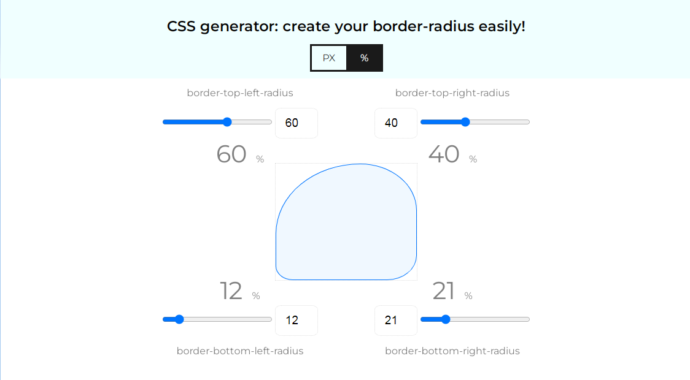

# app-simple-border-radius-generator

Simple CSS border-radius generator (SBRG v1.0). 

This generator helps you to easily create some custom borders to you blocks, and copy CSS code to your Visual Studio editor.
