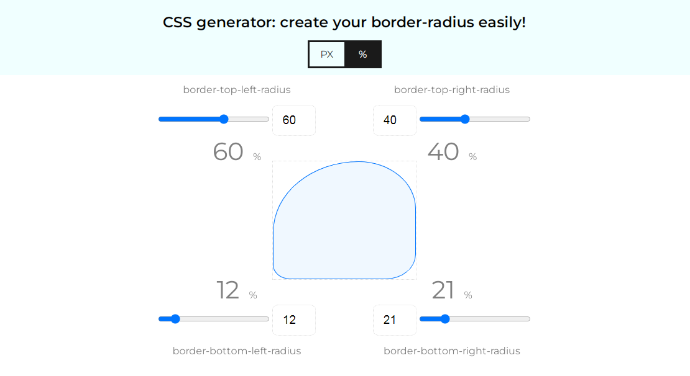

# [Simple CSS border-radius generator (SBRG)](https://getfrontend.github.io/app-sbrg.html)

This generator helps you to easily create some custom borders to you blocks, and copy CSS code to your Visual Studio editor.
